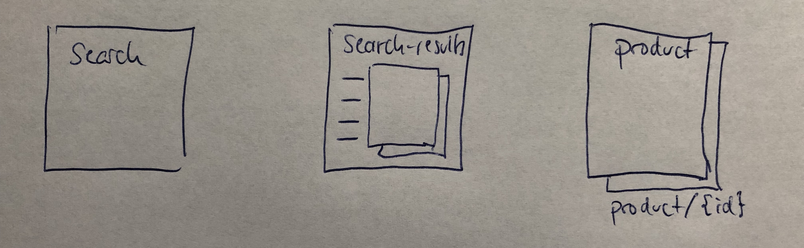
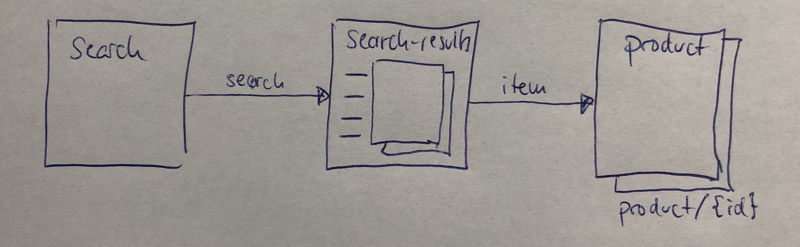
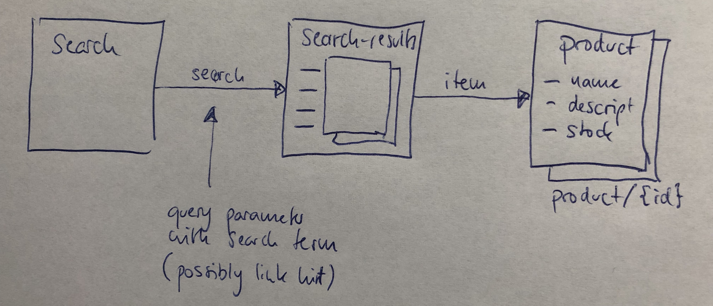
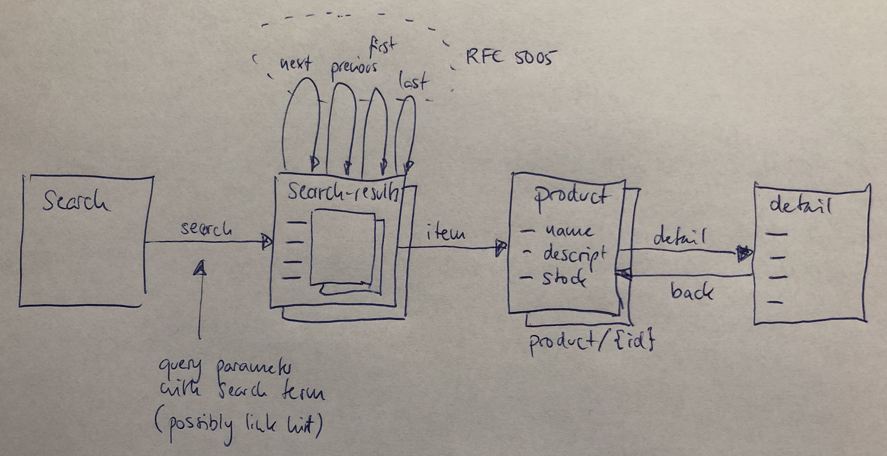

# Simple Editing/Evolving/Exporting Example

Starting from our Slack discussion, here a simple example of how I see API maps being used, being evolved, and how exporting them for documentation fits into the picture.

I start with a simple set of resources, in this case a API to search a product catalog. The model ideas shown here already are that the search results are a collection (which could be a specifically supported type of resource), and the product resource is a set of resources (as indicated by the URI template).

This is the starting point of the API and already could yield some OpenAPI. From the API map point of view, what is missing so far are links that connect the resources in navigable ways.

Next some links are added. These links must have types, and these types should be used according to *Web Linking*. These links turn the resource view into an actual API map.

This could already be exported as a sketch. If it were exported as a navigable HTML map at `http://example.com/sketch`, then it should have working anchors such as `http://example.com/sketch#product` or http://example.com/sketch/resource/product which would represent the product resource of the sketch. These URIs should remain stable, and they can then be used to be linked from other resources, such as the OpenAPI description.

Some details may be added which would not change the overall set of entities in the API map (same set of resources and links), but more details are added, as the API map is fleshed out a bit.

Re-exporting this API map should simply replace the export the HTML with updated HTML with the added API details. The URIs for the API map entities (resources and links) should remain stable. This means that anybody looking at the older and less detailed maps now simply would get the newer and more detailed version.

