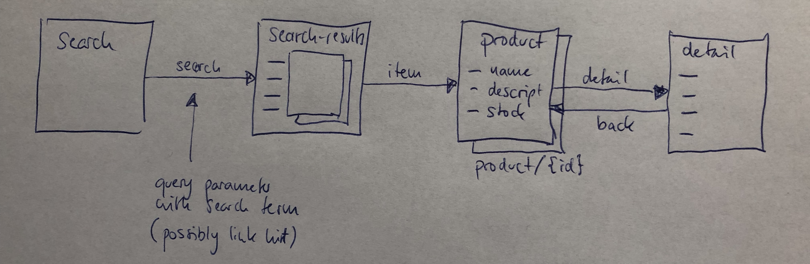

# Simple Editing/Evolving/Exporting Example

Starting from our Slack discussion, here a simple example of how I see API maps being used, being evolved, and how exporting them for documentation fits into the picture.

I start with a simple set of resources, in this case a API to search a product catalog. The model ideas shown here already are that the search results are a collection (which could be a specifically supported type of resource), and the product resource is a set of resources (as indicated by the URI template).

This is the starting point of the API and already could yield some OpenAPI. From the API map point of view, what is missing so far are links that connect the resources in navigable ways.

